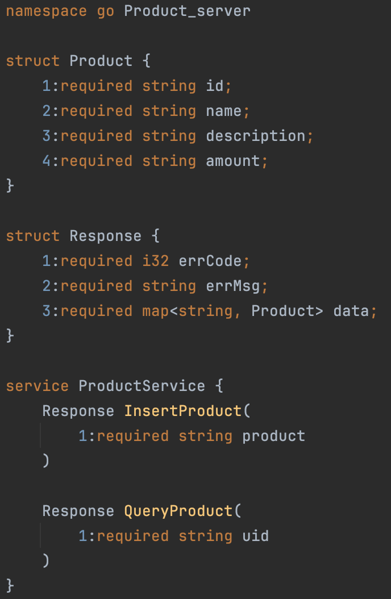
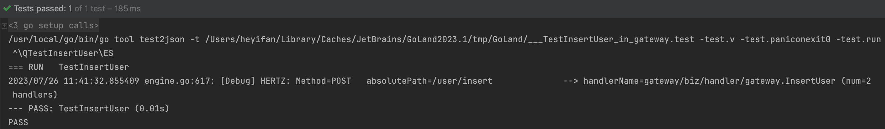

# Milestone 3 README

[TOC]

## **Team Name**

**Escaping With U**

## **Team ID**

**5594**

## **Team Members**

**He Yifan**

**Li Xinyan**

## **Proposed Level of Achievement**

**Project Gemini (Tiktok Project)**

## **Milestone 1** 

- **Poster:**
  - **[5594_Milestone_1.png](https://drive.google.com/file/d/1LcKahANW4h8PetDVYRJC_YWCzDt6EHpB/view?usp=sharing)**

- **Video:**
  - **[5594_Milstone_1.mov](https://drive.google.com/file/d/1sztCGiXxeVAxFDJ5scPrAp7vgk3mvrgj/view?usp=sharing)**

- **Project Log:**
  - **[5594_Milestone1_Project_Log.pdf](https://drive.google.com/file/d/1I6P0bxJPMF8nLCauO6YBYoqSaxRYZsrC/view?usp=sharing)**


## **Milestone 2**

- **Poster:**
  - **[5594_Milestone2_Poster.png](https://drive.google.com/file/d/1i2tYXq_DAvd5mvhKGNW2TlIYGaPOHPmR/view?usp=sharing)**

- **Video:**
  - **[5594_Milstone_2.mp4](https://drive.google.com/file/d/1YuPRWVz1LxCUMO2R3pJaFnxStuEuPVu7/view?usp=sharing)**

- **Project Log:**
  - **[5594_Milestone2_Project_Log.pdf](https://drive.google.com/file/d/1Euo4TYliiQd_SyGdlSMEhtMQfPhb2YC4/view?usp=sharing)**


## **Milestone 3**

- **Link to executable files:** 
  - **[5594_Executable_Files](https://drive.google.com/drive/folders/115Memb2WfJusZ6Rt71P85IXIigN5wXFw?usp=sharing)**

- **Poster:**
  - **[5594_Milestone3_Poster.png](https://drive.google.com/file/d/1r8XjiWtWK1JFtIT-9uhUL6JDzLaf_cHv/view?usp=sharing)**

- **Video:**
  - **[5594_Milstone_3.mp4](https://drive.google.com/file/d/19cGmvQFT3CSOfpMklNhEt-G0G8XAlnVF/view?usp=sharing)**

- **Project Log:**
  - **[5594_Milestone3_Project_Log.pdf](https://drive.google.com/file/d/1QHxq5Z0Na4Wv0__zCKG6QYr6yJuSWn9M/view?usp=sharing)**


## **Tech Stack**

- **Go** 
  - **The Primary language used for building the API Gateway.**

- **Kitex**
  - **Framework for building backend RPC servers.**

- **Hertz**
  - **Framework for building HTTP servers(the API Gateway itself).**

- **GitHub**
  - **Source Control**

- **JSON data interchange format**
  - **Encoding and decoding data.**

- **HTTP**
  - **Request and response structure, HTTP methods, and status codes.**

- **Apache Thrift**
  - **Interface Definition Language(IDL) and binary communication protocol.**


# **Motivation** 

As two passionate year 1 students with a keen interest in TikTok, this opportunity allows us to dive deep into the TikTok community while building an API gateway based on CloudWeGo. Through this project, we eagerly anticipate gaining practical knowledge in Golang, HTTP, JSON, Thrift, and more. Moreover, it offers us hands-on experience in creating HTTP and RPC servers, honing our skills in crucial backend development concepts and technologies. As we embark on this learning journey, our goal is to develop a solid foundation that will propel us further in our backend development endeavours.

## **Aim**

We aim to implement an API gateway that accepts HTTP requests encoded in JSON format, and uses the Generic-Call feature of Kitex to translate these requests into Thrift binary format requests. The API Gateway will then forward the request to one of the backend RPC servers discovered from the registry centre.

And there are some criteria for this API Gateway:

1. The API Gateway should provide a centralised entry point for incoming requests. It should support routing of requests to the appropriate microservices based on defined rules or configurations.
2. The API Gateway should handle request authentication and authorization, ensuring secure communication between clients and microservices.
3. It should support request transformation and data mapping between clients and microservices, if required.

## **User Stories**

Once upon a time, two developers relied on CloudWeGo for their projects. They desired an API Gateway feature to efficiently manage request transmission and build a comprehensive set of microservices systems. Working closely with CloudWeGo's team, the feature was developed, empowering users to streamline communication between microservices. With its seamless integration, developers found increased performance, stability, and scalability. This innovation sparked a thriving community, sharing experiences and transforming the world of microservices development.


# **Features**

1. ## HTTP server built by Hertz 

The API Gateway is implemented with Hertz, following the IDL file named **gateway.thrift**


**This IDL file defines the interfaces for the API services, which are then implemented by the handlers.**

****

The API Gateway also registers all the routers based on the `api.${HTTP Method}` annotation in the IDL. 


### API Descriptions

- `SayHello`  `localhost:8080/hello`

  - Request should use a `GET` method and have a JSON body representing an instance of the following struct:

    ```go
    type User struct {
    	Id      string `json:"id"`
    	Name    string `json:"name"`
    	Avatar  string `json:"avatar"`
    	Address string `json:"address"`
    	Mobile  string `json:"mobile"`
    }
    ```

  - Response will have a JSON body representing an instance of the following struct:

    ```go
    type Response struct {
    	ErrCode int32            `json:"errCode"`
    	ErrMsg  string           `json:"errMsg"`
    	Data    map[string]*User `json:"data"`
    }
    ```

    where the `Data` is a map with a Key `“User”` and the corresponding Value is the `User` instance sent by the request.

- `InsertUser`  `localhost:8080/user/insert`

  - Request should use a `POST` method and have a JSON body with the same format as above.
  - Response will also be as the same format as above.

- `InsertProduct`  `localhost:8080/product/insert`

  - Request should use a `POST` method and have a JSON body representing an instance of the following struct:

    ```go
    type Product struct {
    	Id          string `json:"id"`
    	Name        string `json:"name"`
    	Description string `json:"description"`
    	Amount      string `json:"amount"`
    }
    ```

  - Response will have a JSON body representing an instance of the following struct:

    ```go
    type Response struct {
    	ErrCode int32            `json:"errCode"`
    	ErrMsg  string           `json:"errMsg"`
    	Data    map[string]*Product `json:"data"`
    }
    ```

    where the `Data` is a map with a Key `“Product”` and the corresponding Value is the `Product` instance sent by the request.

-  `Pingpong`  `localhost:8080/hello`

  - Request should use a `GET` method and have a JSON body:

    ```json
    {
      "ping": ANY STRING
    }
    ```

  - Response will have a JSON body representing an instance of the following struct:

    ```go
    type Response struct {
    	ErrCode int32            `json:"errCode"`
    	ErrMsg  string           `json:"errMsg"`
    }
    ```

    where the `ErrMsg` is a string `“Pong”`

-   `QueryUser`  `localhost:8080/user/query`  `GET`

-  `QueryProduct`   `localhost:8080/product/query`  `GET`

  - Above two methods are not implemented due to a lack of database. Request can be a simple JSON object with an “id”, and the response will contain the testUser and testProduct.
    

2. ## Generic-Call feature of Kitex


The API Gateway translates HTTP requests encoded in JSON format from the client to Thrift binary format, using the JSON Mapping Generic-Call feature of Kitex.

JSON Mapping Generic Call means that the user can directly construct JSON string request or response according to the specification, and Kitex will do Thrift codec accordingly.

The `generic.NewThriftFileProvider()` function finds the IDL file which defines the RPC services according to the given filePath, and parses the IDL files. Then the `generic.JSONThriftGeneric()` provides the `Generic` parameter for `genericclient.NewClient()` to create a generic client to call the `destService`.

E.g., the `SayHello(context.Context, *app.RequestContext)` function in **gateway_service.go** reads the IDL file defining services for the user server at `uServicePath = ./idl/server_idl/u_service.thrift`, and creates a generic client to call the `SayHello(context.Context, string) (*user_server.Response, error)` destService.


3. ## RPC servers built by Kitex



We have built a user server and a product server for testing purposes. They provide the services that can be called via RPC calls from the API Gateway, such as `SayHello()`, `InsertUser()` and `InsertProduct()`.


These services will return a Response instance comprising a **status code** (200 if the function returns with no error), a piece of **message** and the **data** being transmitted (either a user instance or a product instance). The response will then be sent back to the API Gateway and be JSON serialised as the body of the response to the initial HTTP request.


4. ## Load balancing


Load balancing manages the request distribution, which can evenly distribute requests among available backend RPC servers.

5. ## Service Register and Discovery(consul)

We are using **consul** for service registry and discovery. 

“Consul is a distributed, highly-available, and multi-datacenter aware tool for service discovery, configuration, and orchestration. Consul enables rapid deployment, configuration, and maintenance of service-oriented architectures at massive scale.”


When creating the generic client for generic call, it is provided with an option to have a consul resolver to connect to the consul server at `127.0.0.1:8500` for service discovery.


Meanwhile, each Kitex server is equipped with the consul register at `127.0.0.1:8500`. Upon running the server, its services will be registered and will be discoverable by the API Gateway.


6. ## A mechanism for updating the relationship between services and IDLs, ensuring that the API Gateway can adapt to changes in case of new services and IDL updates, promoting flexibility and maintainability within the project.

This mechanism is implemented under **hertz_server/fileChange.go**.


First, the `NewWatcher()` function reads the status of the IDL file at the given filePath, and watches for any changes in the status, such as the file size and modification time, once every second. If a change is observed, it will call `hzUpdate()` with the script file `“updateIDL.sh”`.


The `hzUpdate()` function will execute the commands inside the `“updateIDL.sh”` file:


`“hz update -idl ./idl/gateway.thrift”` runs the Hertz command line tool to update the API Gateway according to the IDL file.

`“go build”` re-generates the API Gateway executable binary file.


Then, this mechanism is encapsulated into the UpdateIDL() function, and is run on a separate goroutine, which ensures the update is executed asynchronously, so that the API Gateway is not affected.


# **Architecture**


```
.
├── README.md              // README file for GitHub repository
├── docs
│   └── diagram.png
├── hertz_server           // Code for the API GAteway
│   ├── biz								 // Business logics, including handlers
│   ├── build.sh
│   ├── fileChange.go			 // Mechanism to update the gateway if there is a change in idl
│   ├── gateway						 // Executable binary file
│   ├── gateway_test.go		 // Unit tests
│   ├── go.mod
│   ├── go.sum
│   ├── idl								 // Directory for idl files
│   ├── kitex_gen
│   ├── main.go
│   ├── router.go
│   ├── router_gen.go
│   ├── script
│   └── updateIDL.sh
├── kitex_servers					 // Directory for Kitex RPC servers
│   ├── pingpong
│   ├── product_server
│   ├── user_server
│   ├── user_server2
│   └── user_server3
├── testProduct.json
└── testUser.json
```


# **Design Decision**

In the implementation of the API Gateway project, our team has made several design decisions regarding the technology stack and request handling mechanisms. These decisions have been carefully chosen to ensure high-performance, scalability, and efficient communication between microservices. The key design decisions are as follows:

## **1. Hertz used to build HTTP server (API Gateway)**

For the implementation of the API Gateway itself, we have opted for Hertz, a framework specifically designed for building HTTP servers. Hertz provides the necessary tools and utilities to create robust and performant HTTP endpoints, enabling the API Gateway to efficiently handle incoming HTTP requests from clients. Also, the Hertz framework provides a command line tool called hz for generating scaffolding for Hertz projects based on Thrift IDL.

## **2. HTTP Requests Encoded in JSON**

To ensure compatibility and ease of use, the API Gateway accepts incoming HTTP requests encoded in JSON format. JSON is a widely adopted data interchange format that allows for easy encoding and decoding of data in a human-readable and machine-readable manner. By accepting JSON requests, the API Gateway can seamlessly communicate with clients and microservices, simplifying data exchange.

## **3. Translation of JSON Requests to Thrift Binary Format**

Upon receiving JSON-encoded requests, the API Gateway employs the Generic-Call feature of Kitex to translate these requests into Thrift binary format. Thrift is an Interface Definition Language (IDL) and binary communication protocol, known for its efficiency and compactness. By converting JSON requests to Thrift binary format, the API Gateway can reduce the overhead of data transmission and improve overall performance.

## **4. Kitex used to build RPC servers**

We have chosen Kitex as the primary Golang RPC framework to build the RPC servers. Kitex is renowned for its high-performance and strong-extensibility, making it an ideal choice for building efficient and reliable RPC-based services. By utilising Kitex, it is ensured that the RPC servers can handle a large number of concurrent requests, facilitating seamless communication between microservices.

## **5. Load Balancing for Request Distribution**

To ensure optimal utilisation of backend RPC servers and avoid overloading any specific instance, the API Gateway incorporates load balancing mechanisms. Load balancing evenly distributes incoming requests among the available backend RPC servers. This enables efficient utilisation of resources and ensures that the system can handle varying loads without bottlenecks.

## **6. Service Registry and Discovery with Kitex**

Kitex provides a service registration and discovery mechanism, allowing backend RPC servers to register themselves within the register centre. The API Gateway can then discover and locate these services dynamically. By leveraging Kitex-based service register and discovery, the API Gateway can efficiently manage and route requests to the appropriate backend services, ensuring seamless communication and load distribution.

These design decisions collectively contribute to the creation of a high-performance, scalable, and robust API Gateway. By combining Kitex and Hertz for building RPC and HTTP servers, respectively, and integrating load balancing and service discovery mechanisms, the team aims to deliver an efficient and reliable solution for request handling and communication between microservices.


# **Usage Instruction**

**==Docker is needed==**

1. First, set up the consul server for service registry:

`docker pull hashicorp/consul`

`docker run -d -p 8500:8500 hashicorp/consul consul agent -dev -client=0.0.0.0`

2. Then, download the executable files from [5594_Executable_Files](https://drive.google.com/drive/folders/115Memb2WfJusZ6Rt71P85IXIigN5wXFw?usp=sharing), and execute them to run the server:
3. Finally, use Postman or other tools to send the requests to `0.0.0.0:8080`.

e.g. Send a GET request to `0.0.0.0:8080/hello` with the following JSON body:

```json
{
  "user": {
    "id": "1",
    "name": "Aaron",
    "avatar": "IronMan",
    "address": "NUS",
    "mobile": "99999999"
  }
}
```

Send a POST request to 0.0.0.0:8080/product/insert with the following JSON body:

```json
{
  "product": {
    "id": "1",
    "name": "Infinity Gauntlet",
    "description": "A metal gauntlet used to house the six Infinity stones.",
    "amount": "0"
  }
}
```


# **Implementation Details**

To implement the API Gateway for handling communication between microservices, we utilised the following technologies: Kitex for building the RPC servers, Hertz for building the HTTP servers, and Thrift for encoding and decoding JSON requests into Thrift binary format. The API Gateway will also integrate load balancing to ensure even distribution of requests among available backend RPC servers. The implementation details are as follows:

## **1. RPC Servers Built with Kitex:**

- Define Thrift IDL: Wel started by defining the Thrift Interface Definition Language (IDL) file that outlines the services and functions provided by the RPC servers. This IDL will serve as the contract between the API Gateway and the RPC servers.

- Generate Code: Using the Thrift IDL, we generated Golang code for the RPC servers. The generated code includes the structures and functions needed to handle incoming Thrift binary requests.

- Implement Handlers: Based on the generated code, we implemented handlers for each defined service. These handlers will contain the business logic for processing incoming requests and generating responses.

- Load Balancer Integration: The RPC servers integrate a load balancing mechanism to manage the distribution of incoming requests among available backend RPC server instances. This ensures optimal resource utilisation and prevent overloading of any single server.

- Service Registration: The Kitex-based RPC servers register themselves with the service registry component (e.g., Consul) during startup. This step allows the API Gateway to discover and communicate with the available backend services.

## **2. HTTP Server Built with Hertz:**

- Define API Endpoints: We defined the API endpoints that the API Gateway will expose to clients. These endpoints correspond to the functionalities provided by the backend RPC servers.

- JSON Request Handling: The API Gateway would be configured to accept incoming HTTP requests encoded in JSON format. It includes JSON decoding and validation logic to ensure the correctness of incoming data.

- Request Translation: Upon receiving an HTTP request, the API Gateway would utilise Thrift's encoding and decoding capabilities to translate the JSON request into Thrift binary format. This conversion prepares the request for communication with the backend RPC servers.

- Service Discovery: The API Gateway leverages the service discovery mechanism provided by Kitex (e.g. Consul) to locate available backend RPC servers. This enables the API Gateway to dynamically discover and communicate with the backend services.

- Request Routing: After translating the request and discovering available backend services, the API Gateway routes the request to the appropriate backend RPC server based on predefined rules or configurations. This routing mechanism ensures that each request is directed to the relevant microservice.

- Response Handling: Upon receiving the response from the backend RPC server, the API Gateway processes the response and prepares the JSON response to be sent back to the client.

By implementing the API Gateway with Hertz and integrating Kitex for RPC server communication, we ensure efficient handling of HTTP requests, translation of JSON data to Thrift binary format, and dynamic discovery and routing of requests to the backend microservices. The load balancing mechanism further enhances the system's scalability and performance by evenly distributing requests among available backend RPC servers. The use of service registration and discovery enable seamless communication between the API Gateway and the backend microservices, ensuring a robust and reliable microservices architecture.


# **Software Engineering Principles**

- ## **Single Responsibility Principle (SRP)**

A class or module should have only one reason to change, meaning it should have only one responsibility. By adhering to this principle, code becomes more modular, easier to understand, and less susceptible to bugs as changes are made.

****

The above codes use one struct to handle a single request serving different purposes following the SRP.

- ## **Abstraction & Encapsulation**

Detailed implementations of how to set up a generic client for Generic Call is encapsulated into one method called initGenricClient(), which simplifies the code and avoids repeating the details in every single handler.


- ## **Version Control**


We use Git and GitHub to keep track of every modification to the code.


# **Testings**

- To test if the API Gateway can direct the request to backend RPC servers via Generic Call

  - 
    

  - Expected Response:

    ```json
    {
        "errCode": 200,
        "errMsg": "Pong"
    }
    ```

  - ==PASS==

- **Unit Testing** for handler logic and **Integration Testing** for service registry

  1. Handler logic for `SayHello()` service

     - 
       

     - Expected Response:

       ```json
       {
           "errCode": 200,
           "errMsg": "Hello, Aaron",
           "data": {
               "User": {
                   "id": "1",
                   "name": "Aaron",
                   "avatar": "IronMan",
                   "address": "NUS",
                   "mobile": "99999999"
               }
           }
       }
       ```

     - ==PASS==

  2. Handler logic for `InsertUser()` service

     - 
       

     - Expected Response:

       ```json
       {
           "errCode": 200,
           "errMsg": "User 1 has been inserted successfully!",
           "data": {
               "User": {
                   "id": "1",
                   "name": "Aaron",
                   "avatar": "IronMan",
                   "address": "NUS",
                   "mobile": "99999999"
               }
           }
       }
       ```

     - ==PASS==

  3. Handler logic for `InsertProduct()` service

     - 
       

     - Expected Response:

       ```json
       {
           "errCode": 200,
           "errMsg": "Product 1 has been inserted successfully!",
           "data": {
               "Product": {
                   "id": "1",
                   "name": "Infinity Gauntlet",
                   "description": "A metal gauntlet used to house the six Infinity stones.",
                   "amount": "0"
               }
           }
       }
       ```

     - ==PASS==

- **Integration Testing** for load balancing

  Run the command `ab -n 15 -T 'application/json' -p ./testUser.json http://localhost:8080/user/insert` to use the apache benchmark tool to send 15 POST requests to call the `InsertUser()` service.

  
  The 15 requests are evenly distributed to 3 user_server instances.

  - ==PASS==

- **User Testing**

  - We have gathered 17 responses from our friends who have tried to send some requests with Users and Products created by themselves.
  
  - The result is as following:
  
    
  
  - The overall rating for this gateway is positive, however, there are some issues about it.
  
    - First, without a frontend user interface, interviewees(users) may find it difficult to understand the instructions to set up these servers and perform requests, especially for those who lack related knowledge. This is mainly due to our lack of time to learn database and frontend skills to implement a system :(
    - Second, one user pointed out that the key value pairs of the JSON body returned by the gateway were not in the same order as he sent. We have also noticed this when we were conducting the unit testing, and this may be due to the order of key-value pairs being not important in JSON struct.


# **Benchmarking & Performance Analysis**

For benchmarking, we have used the ‘testing’ package of Golang and Hertz. We have gotten the following result: 

1. BenchmarkSayHello


2. BenchmarkInsertUser


3. BenchmarkInsertProduct


We have also used **Apache Bench** and **pprof** for benchmarking:

We have run some commands like :`ab -n 5000 -c 100 -T 'application/json' -p ./testProduct.json http://localhost:8080/product/insert`, which means sending 5000 requests with a JSON body in the `testProduct.json` file, where every 100 are in concurrency, to `http://localhost:8080/product/insert`.

And we have obtained the following result:

From the Callgraph, we noticed that the generic call used very little resources compared to the Golang `syscall.syscall` function, thus it is somewhat efficient.

However, when it comes to the space-usage, the whole framework is less efficient:


### Interpreting the Callgraph

- **Node Color**:
  - large positive cum values are red.
  - cum values close to zero are grey.
- **Node Font Size**:
  - larger font size means larger absolute flat values.
  - smaller font size means smaller absolute flat values.
- **Edge Weight**:
  - thicker edges indicate more resources were used along that path.
  - thinner edges indicate fewer resources were used along that path.
- **Edge Color**:
  - large positive values are red.
  - values close to zero are grey.
- **Dashed Edges**: some locations between the two connected locations were removed.
- **Solid Edges**: one location directly calls the other.
- **"(inline)" Edge Marker**: the call has been inlined into the caller.


### Side Note

We have noticed that if we send 5000 requests immediately after the previous operations, it almost fails to do so every time. However, we are unable to find out whether it is due to our machine, Apache Bench or the framework.


# **Future development** 

As a result of the time constraints within our project, we have currently implemented the features mentioned above. However, we recognize the importance of expanding the project to better meet our clients' needs in the future. With this in mind, we have identified several areas for improvement that we are considering:

**Enhanced Routing Mechanism:**

As the system expands and more microservices are added, enhance the routing mechanism of the API Gateway to support more sophisticated rules and configurations. This could include implementing support for dynamic routing based on factors like request headers, user roles, or specific client attributes. 

**Security Enhancements:**

Stay up-to-date with the latest security best practices and continuously enhance the API Gateway's security features. Regularly audit and assess security vulnerabilities, and conduct penetration testing to identify and address potential weaknesses. 

## **Timeline**

| Milestone        | Tasks                                                        | Description                                                  | Start Date | End Date  |
| ---------------- | ------------------------------------------------------------ | ------------------------------------------------------------ | ---------- | --------- |
| M3               | conduct overall testing of the API Gateway                   | carry out testing(including unit testing, integration testing, system testing and user testing) on backend RPC servers, and HTTP servers, ensuring proper functionality and performance | 8/7/2023   | 18/7/2023 |
|                  | conduct benchmarking and performance analysis of the API Gateway | identify areas for improvement and optimization.             | 19/7/2023  | 23/7/2023 |
|                  | Refinement                                                   | fix whatever issues we found. finalise the project document  | 23/7/2023  | 28/7/2023 |
| Final Refinement | Give a final polish of our project                           | We will further improve our API Gateway based on the feedback from advisor and peers, and try to find more areas of improvement | 30/7/2023  | 10/8/2023 |